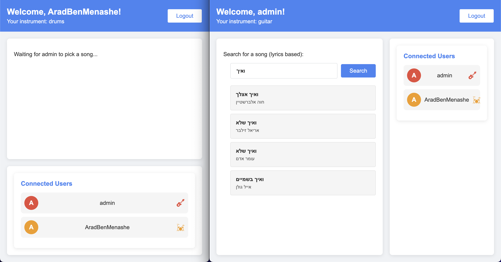

# JaMoveo

JaMoveo is a live music session player.

- Try right now at [jamoveo.ddns.net](http://jamoveo.ddns.net:8080/)!
- For admin access, go to [jamoveo.ddns.net/admin](http://jamoveo.ddns.net:8080/admin) and sign in with the following credentials: (username: admin, password: 123456)

[](http://jamoveo.ddns.net:8080/)

## Features

- User Authentication:
  - Log in / Sign up
  - Log in as admin (go to /admin and sign in with the default input)
- Session Management:
  - Join a session
  - Disconnect from a session
- Real-time Updates:
  - Update the current song in the session
  - Sync all connected clients with the current song
  - Show current connected users
- Multilingual Support - English & Hebrew language support
- Auto scroll
- Find songs by scraping Tab4U website
- Display song's lyrics and chords from Tab4U website

## Technologies

- Backend:
  - Node.js with TypeScript
  - WebSocket for real-time communication
  - MongoDB for data storage
- Frontend:
  - React.js with TypeScript

### Installation

1. Clone the repository:

```

git clone https://github.com/yourusername/jamoveo.git
cd jamoveo

```

2. Set up the MongoDB database using Docker Compose:

```

docker-compose up --build

```

3. Install dependencies for the server:

```

cd server
npm install

```

4. Install dependencies for the frontend:

```

cd ../client
npm install

```

### Running the Application

1. Start the Node.js server:

```

cd server
npm run dev

```

2. In a new terminal, start the React frontend:

```

cd client
npm run dev

```

3. Open your browser and navigate to `http://localhost:5173`

## Configuration

To use MongoDB Atlas instead of a local MongoDB instance:

1. Create a `.env` file in the server directory
2. Add your MongoDB Atlas connection string:

```

MONGOURL=your_mongodb_atlas_connection_string

```
